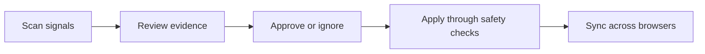

# Bookmark Sync

[简体中文](README.zh-CN.md)

Bookmark Sync is an AI-first Chromium extension for keeping a bookmark library useful over time. It finds duplicate saves, checks whether links still work, and turns a noisy folder tree into reviewable organization suggestions. Cross-browser sync, history, and safety snapshots remain the reliable foundation underneath those decisions.

## Product focus

The primary user loop is:



The extension's Manager opens on a **Workspace** that puts AI curation, link health, and duplicate groups first. Sync is intentionally a secondary path: it preserves the user's approved organization across devices, but it never silently makes organization decisions.

> 📖 **Architecture deep dive**: See [docs/ARCHITECTURE.md](docs/ARCHITECTURE.md) for the four layers, the suggestion pipeline, reachability states, 3-way merge, and safety model.
>
> 🧭 **Product direction**: See [docs/PRODUCT_DIRECTION.md](docs/PRODUCT_DIRECTION.md) for the new information architecture, primary workflows, and scope boundaries.

## What is implemented

### Intelligence workspace

- Workspace dashboard with actionable signal counts and an explicit **scan → review → apply** loop.
- OpenAI-compatible organizer that returns validated, suggestion-only results for moving bookmarks, creating folders, merging folders, and possible semantic duplicates.
- Exact and normalized URL duplicate detection. Duplicate groups are surfaced for review; they are never deleted automatically.
- Link health checks with streamed progress and distinct `reachable`, `broken`, `restricted`, `error`, and `unsupported` states.
- Manual visit, recheck, ignore/unignore, and confirmed delete actions for link-health findings.
- Every AI suggestion shows the original bookmark, destination, confidence, and rationale before it can be accepted.

### Safety foundation

- MV3 extension with a compact Popup and full Manager workspace.
- Canonical IDs and persisted browser-ID mappings with URL/title/path fallback matching.
- Local-only, GitHub, WebDAV, and self-hosted HTTP storage providers.
- Publish, Mirror, and Two-way Sync modes.
- Pure 3-way merge with independent-add preservation and explicit edit/move/delete conflicts.
- Sync preview, 30% destructive-change protection, sync lock, debounced bookmark events, and local safety snapshots.
- Local/GitHub/server history and restore-as-a-new-version.

## Install and build

Requires Node.js 22 or newer for the built-in SQLite runtime used by the optional server.

```bash
npm install
npm test
npm run typecheck
npm run build
```

The unpacked extension is written to `extension/dist`.

## Install in Chrome or Edge

1. Run `npm run build`.
2. Open `chrome://extensions` or `edge://extensions`.
3. Enable Developer mode.
4. Click **Load unpacked** and select `extension/dist`.
5. Open the extension's options page. Start with **AI curation** or **Link health**; configure a storage provider only when cross-browser persistence is needed.

## AI curation

In Manager → Settings → AI Assistant enter:

- An OpenAI-compatible Base URL, such as `https://api.openai.com/v1` or another compatible endpoint.
- An API key.
- A model name. It is intentionally not hardcoded.

Use **AI curation → Generate suggestions**. The request contains only bookmark title, URL, hostname, folder path, and canonical ID. The response must contain a JSON `suggestions` array and is validated before it reaches the review queue.

AI cannot delete, move, merge, rename, or create anything on its own. **Accept** sends the proposed local change through the normal sync plan, destructive-change checks, and `applyRepositoryToBrowser`. The endpoint is configurable so users can choose a compatible hosted or self-hosted model. Bookmark metadata is sent to that endpoint only when the user runs an analysis.

## Link health checks

Open Manager → **Link health** and choose **Start check**. The scanner reads checkable URLs and reports:

- `reachable`: the request resolved successfully;
- `broken` / `error`: the URL did not resolve or the check failed;
- `restricted`: the site or network policy blocked an automated check;
- `unsupported`: the URL scheme is not checked automatically.

Restricted and error results are not treated as proof that a page is gone. Users can open a link manually, recheck it, ignore a known false positive, or delete the associated bookmark after a confirmation. The check never changes bookmarks by itself.

## Storage providers and sync

The intelligence features work with the browser's current local bookmark tree. A provider is required only for cross-browser storage.

### GitHub Provider

Create or choose a repository owned by the user. A private repository is supported. A fine-grained GitHub token should have repository **Contents: Read and write** permission for that repository. In Manager → Settings choose GitHub and fill in:

- Token
- Owner
- Repository
- Branch, normally `main`
- File path, normally `bookmarks.json`

The adapter stores only the canonical JSON repository in that path. Each push uses the GitHub Contents API and creates a commit. History reads commits touching the configured file. Tokens are kept in `chrome.storage.local` and are never printed by the extension.

### WebDAV Provider

Supports standard WebDAV services such as 坚果云 / Jianguoyun, Nextcloud, ownCloud, Synology NAS, AList, and InfiniCloud. In Manager → Settings choose WebDAV and fill in:

- **Server URL**: the WebDAV endpoint root or folder URL;
- **Username**: the account username or email;
- **Password**: the application password or token;
- **File Path**: the filename or relative path, normally `bookmarks.json`.

The WebDAV adapter reads and writes the canonical JSON model using `GET`, `PUT`, and `MKCOL`. Version history is preserved as lightweight snapshots in a `history/` subfolder. Use **Test connection** before syncing.

### Self-hosted server

Start the optional server with a token of your own:

```bash
SYNC_API_TOKEN='replace-with-a-long-random-token' npm run server:dev
```

Optional variables:

```text
HOST=127.0.0.1
PORT=8787
SYNC_DB_PATH=./data/bookmarks.sqlite
```

`server/.env.example` contains the same safe placeholder configuration for local setup. Copy it to `server/.env` and replace the token before starting the server; `.env` files remain ignored by Git.

The API is:

```text
GET  /health
GET  /api/repository
PUT  /api/repository
GET  /api/history
GET  /api/history/:id
POST /api/history/:id/restore
```

All routes except `/health` require `Authorization: Bearer <SYNC_API_TOKEN>`. The server stores immutable snapshots in SQLite and makes a restored snapshot the current one by inserting a new revision.

## Testing two-way sync

1. Load the extension in Chrome and Edge.
2. Configure both with the same GitHub repository or self-hosted server and choose **Two-way Sync**.
3. Sync once from one browser to establish the base snapshot.
4. Add a bookmark in Chrome and another in Edge without syncing immediately.
5. Sync both browsers. Each side's new canonical node is retained and both browsers converge on the merged tree.

For a first-run local-only setup, the first sync bootstraps a local snapshot. For a shared provider, let the first browser finish its initial sync before using the second browser as an active client.

## Testing a conflict

1. Establish a shared base containing a bookmark such as `ChatGPT`.
2. Move it to `Tools` in Chrome and sync only Chrome.
3. Starting from the same base in Edge, move it to `Research` and sync Edge.
4. The Manager pauses with a `move_move` conflict. Choose **This browser** or **Cloud** and apply the selected version.

Edit/edit and delete/edit conflicts follow the same flow. The engine does not guess when the same canonical node was changed differently on both sides.

## Project structure

```text
bookmark-sync/
├── extension/                 # MV3 background, Popup, Manager workspace
├── packages/
│   ├── core/                  # canonical model, organizer, reachability, diff, merge, safety
│   ├── browser-adapters/      # Chromium / Chrome / Edge adapter
│   └── storage-adapters/      # Local, GitHub, WebDAV, self-hosted HTTP
├── server/                    # optional Fastify + SQLite service
├── docs/
│   ├── ARCHITECTURE.md        # system and data-flow reference
│   └── PRODUCT_DIRECTION.md   # product focus and UX contract
├── README.md                  # English project guide
└── README.zh-CN.md            # 简体中文项目指南
```

## Known limitations

- The MVP supports Chrome and Edge only; Safari and Firefox adapters are not included yet.
- Link health checks depend on site and network policies; a restricted result requires manual confirmation.
- GitHub history entries are based on commit metadata; old commit bookmark counts are not fetched until a version is opened.
- Duplicate detection reports review groups; it does not merge or delete duplicates automatically.
- AI folder merge and semantic-duplicate suggestions are informational in this MVP. Move and create-folder suggestions can be accepted when their target can be resolved safely.
- There is no end-to-end hosted authentication, encryption-at-rest layer, or server-side user account system.
- A GitHub push fetches the current file immediately before writing; a rare concurrent push can still require a later manual sync.

## Next most valuable steps

1. Add a richer review diff and batch workflow for duplicate resolution and folder merge suggestions.
2. Add optional scheduled link health checks with a persisted last-scan report.
3. Add optimistic remote revision / ETag checks and a richer concurrent-push conflict flow.
4. Add Firefox/Safari adapters and an S3 provider using the existing interfaces.
5. Add encrypted credential storage and optional external secret managers.
