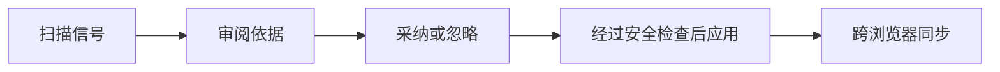

# Bookmark Sync（书签同步）

[English](README.md)

Bookmark Sync 是一个以 AI 为先的 Chromium 浏览器扩展，帮助用户长期维护真正有用的收藏夹。它可以发现重复收藏、检查链接是否仍然可用，并把杂乱的文件夹树整理成可审阅的组织建议。跨浏览器同步、版本历史和安全快照则作为可靠底座，保护这些已经确认的决定。

## 产品重点

主要用户路径是：



扩展的 Manager 会打开一个以 **工作台** 为中心的界面，把 AI 整理、链接体检和重复项分组放在首要位置。同步是有意保持为次级路径：它负责在设备之间保存用户已确认的整理结果，不会默默替用户做决定。

> 📖 **架构详解**：参见 [docs/ARCHITECTURE.md](docs/ARCHITECTURE.md)，了解四层架构、建议流程、可达性状态、三方合并和安全模型。
>
> 🧭 **产品方向**：参见 [docs/PRODUCT_DIRECTION.md](docs/PRODUCT_DIRECTION.md)，了解新的信息架构、主要工作流和范围边界。

## 已实现功能

### 智能工作台

- 工作台展示可处理的信号数量，并明确呈现“扫描 → 审阅 → 应用”的闭环。
- 支持 OpenAI 兼容的整理器，返回经过校验、仅供建议的移动收藏、新建文件夹、合并文件夹和可能重复项结果。
- 支持精确 URL 和规范化 URL 的重复检测。重复分组只会进入审阅队列，不会自动删除。
- 支持流式链接体检，并区分 `reachable`、`broken`、`restricted`、`error` 和 `unsupported` 状态。
- 支持手动访问、重新检测、忽略/取消忽略，以及确认后删除链接体检中的收藏。
- 每条 AI 建议都会展示原收藏、目标位置、置信度和理由，确认后才能采纳。

### 安全底座

- MV3 扩展，包含紧凑 Popup 和完整 Manager 工作台。
- 使用规范化 ID，并持久化浏览器 ID 映射；当映射缺失时支持 URL、标题和路径回退匹配。
- 支持仅本地、GitHub、WebDAV 和自建 HTTP 服务存储。
- 支持 Publish、Mirror 和 Two-way Sync 三种同步模式。
- 纯函数三方合并，保留双方独立新增，并明确暴露编辑/移动/删除冲突。
- 支持同步预览、30% 破坏性变更保护、同步锁、防抖书签事件和本地安全快照。
- 支持本地/GitHub/服务端版本历史，并以“恢复为新版本”的方式恢复数据。

## 安装与构建

服务端使用 Node.js 内置 SQLite 运行时，因此需要 Node.js 22 或更高版本。

```bash
npm install
npm test
npm run typecheck
npm run build
```

未打包的扩展会输出到 `extension/dist`。

## 安装到 Chrome 或 Edge

1. 运行 `npm run build`。
2. 打开 `chrome://extensions` 或 `edge://extensions`。
3. 开启“开发者模式”。
4. 点击“加载已解压的扩展”，选择 `extension/dist`。
5. 打开扩展的选项页。可以先使用 **AI 整理** 或 **链接体检**；只有需要跨浏览器持久化时，才配置存储提供商。

## AI 整理

在 Manager → 设置 → AI 助手中填写：

- OpenAI 兼容的 Base URL，例如 `https://api.openai.com/v1` 或其他兼容端点；
- API key；
- 模型名称，项目不会硬编码模型。

使用 **AI 整理 → 生成建议**。请求只包含收藏标题、URL、主机名、文件夹路径和规范化 ID。响应必须包含 JSON `suggestions` 数组，并在进入审阅队列前完成校验。

AI 不能自行删除、移动、合并、重命名或创建内容。点击 **采纳** 后，变更会进入正常的同步计划、破坏性变更检查和 `applyRepositoryToBrowser` 写入管道。端点可以配置为兼容的托管模型或自建模型。只有用户主动运行分析时，收藏元数据才会发送到配置的端点。

## 链接体检

打开 Manager → **链接体检**，点击 **开始检查**。扫描器会读取可检查的 URL，并报告：

- `reachable`：请求成功解析；
- `broken` / `error`：URL 无法解析或检查失败；
- `restricted`：站点或网络策略阻止了自动检查；
- `unsupported`：该 URL 协议不会被自动检查。

`restricted` 和 `error` 不代表页面一定已经消失。用户可以手动打开链接、重新检查、忽略已知误报，或在确认后删除对应收藏。检查过程不会自行修改收藏夹。

## 存储提供商与同步

智能功能直接使用浏览器当前的本地收藏夹树。只有需要跨浏览器存储时，才需要配置提供商。

### GitHub 提供商

创建或选择一个由自己拥有的仓库，也支持私有仓库。细粒度 GitHub token 应对该仓库拥有 **Contents: Read and write** 权限。在 Manager → 设置中选择 GitHub 并填写：

- Token
- Owner
- Repository
- Branch，通常为 `main`
- File path，通常为 `bookmarks.json`

适配器只会在该路径保存规范化 JSON 仓库。每次推送都会调用 GitHub Contents API 并创建一个 commit。历史记录通过读取涉及该文件的 commit 获取。Token 保存在 `chrome.storage.local` 中，扩展不会打印它。

### WebDAV 提供商

支持标准 WebDAV 服务，例如坚果云 / Jianguoyun、Nextcloud、ownCloud、Synology NAS、AList 和 InfiniCloud。在 Manager → 设置中选择 WebDAV 并填写：

- **服务器 URL**：WebDAV 端点根地址或文件夹 URL；
- **用户名**：账户用户名或邮箱；
- **密码**：应用密码或 token；
- **文件路径**：文件名或相对路径，通常为 `bookmarks.json`。

WebDAV 适配器使用 `GET`、`PUT` 和 `MKCOL` 读写规范化 JSON 模型，并在 `history/` 子目录保存轻量级快照。同步前可以先点击 **测试连接**。

### 自建服务

使用自定义 token 启动可选服务：

```bash
SYNC_API_TOKEN='replace-with-a-long-random-token' npm run server:dev
```

可选环境变量：

```text
HOST=127.0.0.1
PORT=8787
SYNC_DB_PATH=./data/bookmarks.sqlite
```

`server/.env.example` 提供了同样的安全占位配置，便于本地启动。可以将它复制为 `server/.env` 并替换 token；真正的 `.env` 文件仍会被 Git 忽略。

API 如下：

```text
GET  /health
GET  /api/repository
PUT  /api/repository
GET  /api/history
GET  /api/history/:id
POST /api/history/:id/restore
```

除 `/health` 外，所有路由都要求 `Authorization: Bearer <SYNC_API_TOKEN>`。服务端把不可变快照保存到 SQLite；恢复快照时会插入一个新 revision，并将其设为当前版本。

## 测试双向同步

1. 在 Chrome 和 Edge 中加载扩展。
2. 两边配置同一个 GitHub 仓库或自建服务，并选择 **Two-way Sync**。
3. 先在一个浏览器执行一次同步，建立基础快照。
4. 不要立即同步，分别在 Chrome 和 Edge 中各添加一个收藏。
5. 分别同步两边。双方新增的规范化节点都会被保留，最终两边收敛到同一棵树。

首次仅本地运行时，第一次同步会建立本地快照。使用共享提供商时，先让第一个浏览器完成初始化，再让第二个浏览器作为活跃客户端接入。

## 测试冲突处理

1. 建立一个包含 `ChatGPT` 等收藏的共享基础版本。
2. 在 Chrome 中将它移动到 `Tools`，只同步 Chrome。
3. 从同一个基础版本开始，在 Edge 中将它移动到 `Research`，再同步 Edge。
4. Manager 会暂停并显示 `move_move` 冲突。选择 **This browser** 或 **Cloud**，然后应用选择的版本。

编辑/编辑和删除/编辑冲突遵循相同流程。当同一个规范化节点在双方发生不同修改时，引擎不会擅自猜测结果。

## 项目结构

```text
bookmark-sync/
├── extension/                 # MV3 Background、Popup、Manager 工作台
├── packages/
│   ├── core/                  # 规范模型、整理器、可达性、diff、merge、安全
│   ├── browser-adapters/      # Chromium / Chrome / Edge 适配器
│   └── storage-adapters/      # Local、GitHub、WebDAV、自建 HTTP 存储
├── server/                    # 可选 Fastify + SQLite 服务
├── docs/
│   ├── ARCHITECTURE.md        # 系统与数据流参考
│   └── PRODUCT_DIRECTION.md   # 产品重点与 UX 契约
├── README.md                  # English 项目指南
└── README.zh-CN.md            # 简体中文项目指南
```

## 已知限制

- MVP 目前只支持 Chrome 和 Edge，尚未包含 Safari 与 Firefox 适配器。
- 链接体检受站点和网络策略影响；`restricted` 结果需要人工确认。
- GitHub 历史条目基于 commit 元数据；打开具体版本前不会获取旧 commit 的收藏数量。
- 重复检测只提供审阅分组，不会自动合并或删除重复项。
- AI 的文件夹合并和语义重复建议在当前 MVP 中仅供参考；移动和新建文件夹建议在目标可安全解析时可以采纳。
- 当前没有端到端托管认证、静态加密层或服务端用户账户系统。
- GitHub 推送会在写入前立即读取当前文件；极少数并发推送场景仍可能需要稍后手动同步。

## 下一步最有价值的工作

1. 为重复项处理和文件夹合并建议增加更丰富的审阅 diff 与批量操作。
2. 增加可选的定时链接体检和持久化的最近扫描报告。
3. 增加基于远端 revision / ETag 的乐观并发检查，以及更完善的并发推送冲突流程。
4. 增加 Firefox/Safari 适配器和基于 S3 的提供商，复用现有接口。
5. 增加加密凭据存储和可选的外部密钥管理器。

## 开发校验

GitHub Actions 会在每次 push 和 Pull Request 中运行：

```bash
npm test
npm run typecheck
npm run build
```
