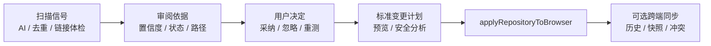
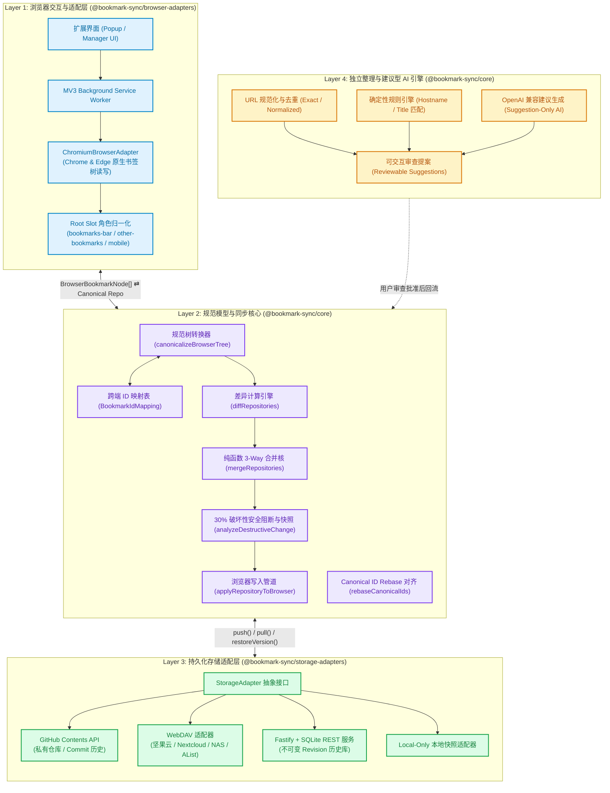
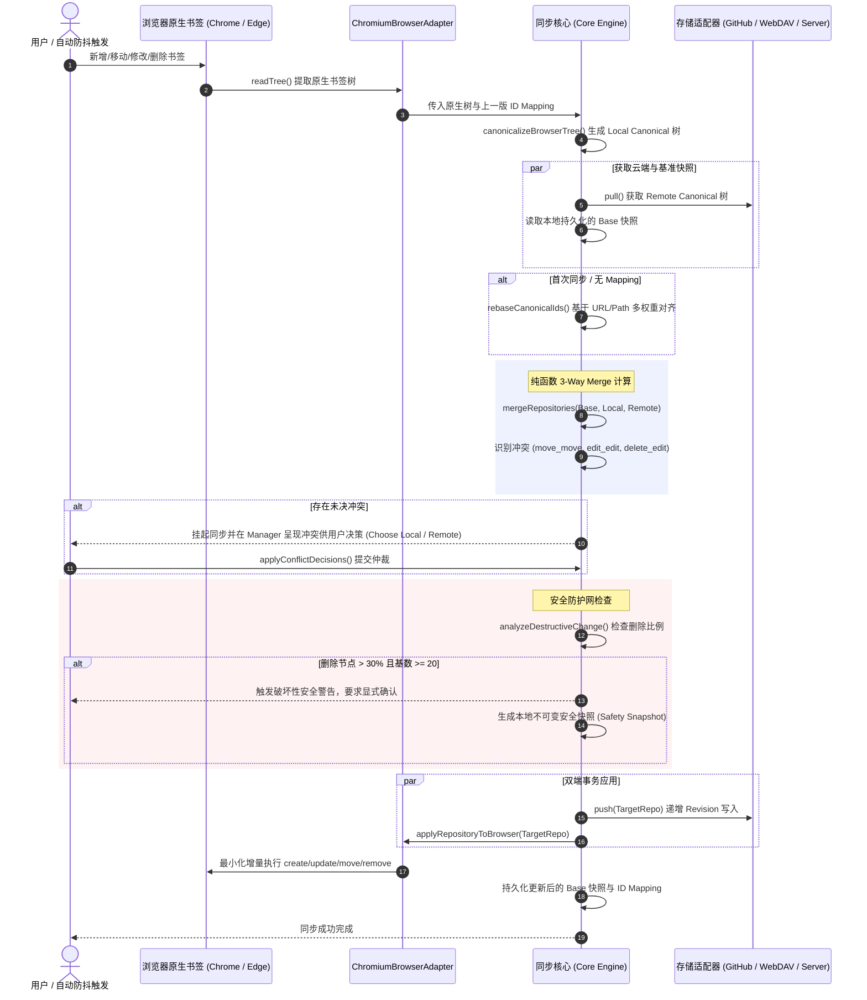
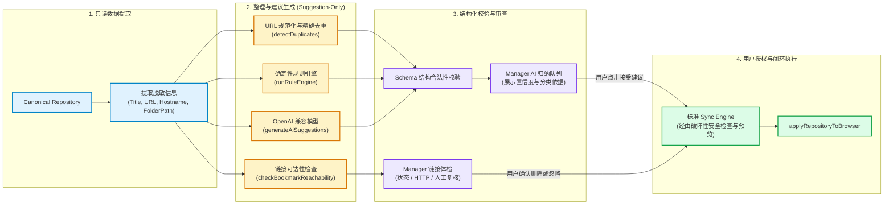
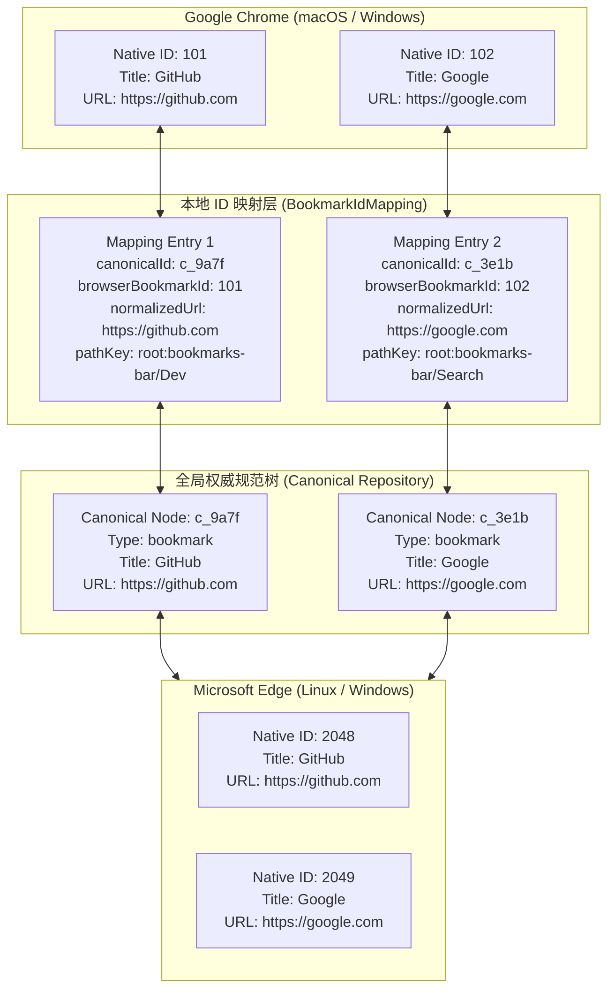

# Bookmark Sync 架构设计与流程图解

本文档说明 Bookmark Sync（书签同步）如何把 AI 归纳、链接体检和重复项发现放在用户路径中心，同时保持 Canonical Model、同步核心、存储适配器和安全写入管道的独立性。同步仍然是底层可靠性能力：它保存用户已经审核通过的决定，不替用户做整理决定。

## 0. 产品中心与责任边界



### 用户路径的四个硬约束

1. **扫描是只读的**：AI、重复检测和链接体检不能直接写浏览器。
2. **结果要带不确定性**：`restricted`、`error` 和 `unsupported` 不等同于“链接已失效”。
3. **建议先审后做**：AI 输出必须通过 schema 校验，并展示对象、目标、理由和置信度。
4. **所有写入走同一条路**：无论来自 AI、规则还是手工维护，都要进入 diff / safety / apply 管道；同步只负责把结果保存到其他端。

---

## 1. 系统四层分层架构 (Layered Architecture)

系统遵循清晰的四层正交架构，核心领域层（Core）严格保持平台中立，不依赖任何浏览器特定 API。



---

## 2. 3-Way 同步与合并流程 (3-Way Merge & Sync Lifecycle)



---

## 3. 冲突判定与解决决策树 (Conflict Resolution Matrix)

```mermaid
flowchart TD
    Start["检测到相同 Canonical ID 节点在双端存在差异"] --> CheckBase{"节点在 Base 快照中是否存在?"}

    CheckBase -->|不存在 (双端新增)| CheckAdd{"Local 与 Remote 内容是否完全一致?"}
    CheckAdd -->|一致| AutoAdd["自动保留该节点"]
    CheckAdd -->|不一致| ConflictAdd["标记 edit_edit 冲突 (提示选择本地或云端版本)"]

    CheckBase -->|存在| CheckDelete{"是否有单端删除了该节点?"}
    CheckDelete -->|双端均未删除| CheckContentMove{"两端内容或位置是否发生变更?"}
    CheckDelete -->|仅 Local 删除, Remote 修改| ConflictDelEdit1["标记 delete_edit / delete_move 冲突"]
    CheckDelete -->|仅 Remote 删除, Local 修改| ConflictDelEdit2["标记 delete_edit / delete_move 冲突"]
    CheckDelete -->|单端删除, 另一端无变更| AutoDelete["自动删除该节点"]

    CheckContentMove -->|两端无冲突变更| AutoMerge["自动融合属性与位移 (无缝合并)"]
    CheckContentMove -->|两端同时修改相同字段| ConflictEdit["标记 edit_edit 冲突"]
    CheckContentMove -->|两端移动至不同父目录| ConflictMove["标记 move_move 冲突"]

    ConflictAdd --> UserChoice["Manager 界面展示差异 → 用户单选确认 → 生成新 Revision"]
    ConflictDelEdit1 --> UserChoice
    ConflictDelEdit2 --> UserChoice
    ConflictEdit --> UserChoice
    ConflictMove --> UserChoice

    classDef conflictNode fill:#ffe4e6,stroke:#e11d48,stroke-width:2px,color:#9f1239;
    classDef autoNode fill:#dcfce7,stroke:#16a34a,stroke-width:2px,color:#15803d;
    classDef decisionNode fill:#f1f5f9,stroke:#64748b,stroke-width:2px,color:#334155;

    class ConflictAdd,ConflictDelEdit1,ConflictDelEdit2,ConflictEdit,ConflictMove conflictNode;
    class AutoAdd,AutoDelete,AutoMerge autoNode;
    class CheckBase,CheckAdd,CheckDelete,CheckContentMove decisionNode;
```

---

## 4. 智能治理流水线 (AI, Duplicate & Link Health)



---

## 5. 跨端 Canonical ID 对齐原理 (ID Mapping Model)


